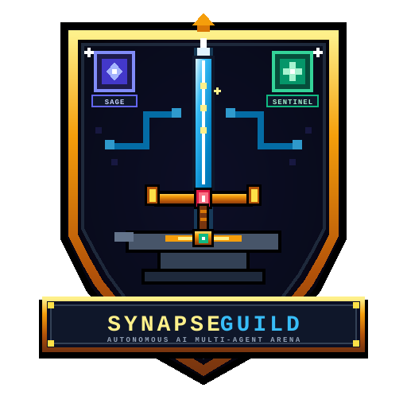

<div align="center">

  <a href="https://gitlab.com/RamsNotes31/synapseguild-rpg-agent">
    
  </a>

  <h1>⚔️ SYNAPSEGUILD 🏰</h1>
  <h3>Autonomous AI Multi-Agent RPG Guildhall Arena</h3>

  <p>
    <em>A 16-bit retro medieval cyber-office where autonomous AI agents deliberate in the War Room, forge production-ready code in the Workshop, and cooperatively battle "The Bug Beast" in the Sandbox Judgment Altar.</em>
  </p>

  <p>
    <a href="https://gitlab.com/RamsNotes31/synapseguild-rpg-agent"></a>
    <a href="https://www.python.org/"></a>
    <a href="https://nodejs.org/"></a>
    <a href="https://fastapi.tiangolo.com/"></a>
    <a href="https://phaser.io/"></a>
    <a href="https://tailwindcss.com/"></a>
    <a href="LICENSE"></a>
  </p>

</div>

---

## 📖 Table of Contents
- [✨ Overview](#-overview)
- [🏰 The Guildhall Architecture & Workflow](#-the-guildhall-architecture--workflow)
- [👥 The 3-Agent Party Roster](#-the-3-agent-party-roster)
- [🎮 Interactive World & Facilities](#-interactive-world--facilities)
- [🚀 Quick Start (1-Click Installer)](#-quick-start-1-click-installer)
- [⚙️ Manual Configuration (`.env`)](#-manual-configuration-env)
- [📱 Dedicated Telegram Bot Remote Control](#-dedicated-telegram-bot-remote-control)
- [📁 Repository Structure](#-repository-structure)
- [📜 License & Credits](#-license--credits)

---

## ✨ Overview

**SynapseGuild** bridges **Autonomous Multi-Agent LLM Orchestration** with **2D Retro Game Visualizations**. Instead of static text streams or black-box terminal outputs, your AI agents inhabit a living, interactive 16-bit medieval office castle:

1. **Dialectical Consensus Engine:** Agents gather around the **War Room Table** to debate architectural trade-offs, algorithms, and test boundaries before typing a single line of code.
2. **Polyglot Code Forge:** *The Forge Master* assembles modular Python (`pytest`) or JavaScript (`node:test`) code with live typewriter inspection.
3. **Cooperative Boss Raid Battle:** Agents storm the **Boss Altar** and unleash combo attacks (*Arcane Beam, Forge Smash, Holy Slash*) on **"The Bug Beast"**, draining its HP bar as test suites pass with 100% scores.
4. **Royal Courier & Auto-Wipe TTL:** Approved code artifacts are logged to Git, downloadable as `.zip`, delivered via Telegram, and automatically purged after 15 minutes for zero storage clutter.

---

## 🏰 The Guildhall Architecture & Workflow

```
       🔮 1. WAR ROOM              ☕ 2. BREAK ROOM          📚 3. KNOWLEDGE VAULT
   ┌───────────────────────┐    ┌────────────────────┐    ┌─────────────────────────┐
   │  🧙‍♂️ [The Sage]         │ ─> │  [Watercooler ☕]  │ ─> │  [Naskah Kuno / Docs 📜]│
   │  Architecture & BDD   │    │  Restore Party MP  │    │  Auto-Load Templates    │
   └───────────────────────┘    └────────────────────┘    └─────────────────────────┘
               │                                                       ▲
               ▼                                                       │
   ┌───────────────────────┐                               ┌─────────────────────────┐
   │  ⚒️ [The Forge Master] │ ────────────────────────────> │  ⚖️ [The Grand Inquisitor│
   │  Polyglot Code Craft  │                               │  Boss Raid vs Bug Beast │
   └───────────────────────┘                               └─────────────────────────┘
          ⚒️ 4. THE FORGE                                      ⚔️ 5. BOSS RAID ALTAR
```

### Execution Flow:
1. **Quest Ingress:** The Guild Master dispatches a quest via Web UI or Telegram `/quest`.
2. **War Room Deliberation:** The 3 agents walk to the War Room and debate implementation strategies with animated speech bubbles.
3. **Blueprint Generation:** The Sage formulates technical specifications and test criteria.
4. **Live Code Forging:** The Forge Master moves to the workshop, typing code streamed live to the **Forge Inspector**.
5. **Sandbox Boss Raid:** The Grand Inquisitor audits the code inside an isolated subprocess sandbox. The entire party unleashes attacks on **The Bug Beast**, defeating it upon 100% test pass.
6. **Artifact Delivery & Git Commit:** The Royal Courier commits the victory to Git, enables 1-click `.zip` download, and forwards the file directly to Telegram.

---

## 👥 The 3-Agent Party Roster

| Agent Avatar | Character Title | RPG Class | Core Responsibility |
|:---:|:---|:---:|:---|
| 🧙‍♂️ | **The Sage** | *High Wizard / Architect* | Decomposes raw prompts into modular file plans, interface definitions, and strict BDD acceptance criteria. |
| ⚒️ | **The Forge Master** | *Blacksmith / Craftsman* | Implements clean, dependency-free, production-grade Python or JavaScript code with matching unit tests. |
| ⚖️ | **The Grand Inquisitor** | *Paladin / Sentinel* | Executes zero-trust automated test runners (`pytest` / `node:test`) in isolated sandboxes and deals the final blow to bugs. |

---

## 🎮 Interactive World & Facilities

- 🕹️ **On-Screen D-Pad & Click-To-Move:** Navigate any character across all 5 rooms using the 16-bit virtual joystick or mouse clicks (zero keyboard hijacking).
- ☕ **Watercooler & Coffee Dispenser:** Click the pantry dispenser to trigger a coffee gulp SFX and replenish party MP back to 100%.
- 📚 **Knowledge Vault & Bookshelves:** Click the library bookcases to automatically inject battle-tested coding templates (Calories, Naismith Rule, Temperature, etc.) directly into the Quest Board.
- ⚒️ **Forge Terminal & Anvil:** Click the workshop anvil to sharpen blacksmith tools and boost coding morale.
- 👑 **Guild Master Live Interventions:** Dispatch immediate course-corrections (*"Use simpler modular approach"*, *"Add extreme boundary tests"*) during live War Room debates.
- 🎵 **Adaptive 16-Bit Chiptune BGM:** Built-in Web Audio chiptune synthesizer that dynamically transitions between peaceful lounge melodies and high-octane Boss Battle tracks.
- 🏆 **Guild Hall of Fame & Leveling:** Complete quests to earn **+100 EXP**, trigger level-ups (`LV.1 -> LV.99`), and record permanent victory tablets.

---

## 🚀 Quick Start (1-Click Installer)

### 1. Clone the Repository
```bash
git clone https://gitlab.com/RamsNotes31/synapseguild-rpg-agent.git
cd synapseguild-rpg-agent
```

### 2. Run the Interactive Wizard Installer
```bash
chmod +x install.sh
./install.sh
```

The installer will automatically:
- Check Python 3.10+ and Node.js environments.
- Create an isolated `venv` and install backend dependencies.
- Prompt for your **AI Provider / LLM API Key** (OpenAI, OpenRouter, Groq, DeepSeek, Ollama, etc.).
- Configure optional Telegram Bot credentials.
- Generate the executable launcher script `./start.sh`.

### 3. Launch the Guildhall
```bash
./start.sh
```

Open your browser and enter the arena:
👉 **`http://localhost:8100`**

---

## ⚙️ Manual Configuration (`.env`)

You can manually edit `.env` to connect any OpenAI-compatible LLM endpoint:

```ini
# 🧠 Universal AI Gateway Configuration
SYNAPSE_AI_BASE_URL=https://openrouter.ai/api/v1
SYNAPSE_AI_MODEL=deepseek/deepseek-chat
SYNAPSE_AI_API_KEY=sk-or-v1-your-api-key-here

# 📱 Dedicated Telegram Remote Controller (Optional)
SYNAPSE_TELEGRAM_BOT_TOKEN=8818582573:AAGKKZUwwgrKk0nR3Z88Z875NRcvzlsuWIQ
SYNAPSE_ADMIN_CHAT_ID=606533609

# 🌐 Server & Storage Settings
SYNAPSE_PORT=8100
SYNAPSE_HOST=0.0.0.0
SYNAPSE_CLEANUP_TTL_SECONDS=900
```

---

## 📱 Dedicated Telegram Bot Remote Control

Control your AI party on the go without opening a browser:

1. Create a bot via `@BotFather` and retrieve your token.
2. Put the token and your Telegram User ID in `.env`.
3. Send commands directly to your bot:
   ```text
   /quest Build a mountain hike Naismith time estimation calculator with pytest suite
   ```
4. Watch the party gather and fight on the web interface in real time.
5. Once tests achieve 100% pass, **the bot immediately delivers the zipped code artifact directly to your Telegram chat!**

---

## 📁 Repository Structure

```text
synapseguild-rpg-agent/
├── 📜 install.sh              # 1-Click Interactive Setup Wizard
├── 🚀 start.sh                # Automated Service Launcher
├── 📄 requirements.txt        # Python Backend Dependencies
├── ⚙️ .env.example            # Environment Blueprint
├── 📜 QUEST_LOGS.md           # The Royal Courier Automated Git Victory Tablet
├── 📁 assets/
│   └── 🎨 logo.svg            # 16-Bit Pixel RPG Castle Logo
├── 📁 docs/
│   └── 📄 PRD.md              # Full Product Requirements Document
├── 📁 backend/
│   ├── 🐍 app.py              # FastAPI Engine, WebSocket Hub & REST API
│   ├── 🐍 orchestrator.py     # 3-Agent Dialectical Consensus Pipeline
│   ├── 🐍 llm.py              # Universal Multi-Provider LLM Client
│   ├── 🐍 sandbox_runner.py   # Isolated Code Sandbox (pytest & node:test)
│   ├── 🐍 git_courier.py      # Royal Courier Git Auto-Commit Service
│   ├── 🐍 telegram_bot.py     # Dedicated Telegram Remote Bot Listener
│   └── 📁 agents/
│       ├── 🧙‍♂️ architect.py         # The Sage Agent Logic
│       ├── ⚒️ craftsman.py         # The Forge Master Agent Logic
│       ├── ⚖️ sentinel.py          # The Grand Inquisitor Auditor Logic
│       └── 💬 dialogue_engine.py   # War Room Consensus Discussion Engine
└── 📁 frontend/
    └── 🌐 index.html          # Phaser 3 16-Bit Medieval Office Canvas & Retro Audio
```

---

## 📜 License & Credits

- **Author & Lead Architect:** Rama Danadipa ([@RamsNotes31](https://gitlab.com/RamsNotes31) / [@dasrams](https://github.com/dasrams))
- **Live Deployment:** [rpg.dasrams.biz.id](https://rpg.dasrams.biz.id)
- **License:** [MIT License](LICENSE)

*Built for AI engineers, open-source explorers, and retro gaming enthusiasts. May your tests always pass and your party never run out of Mana!* ⚔️🏰👾☕🚀
